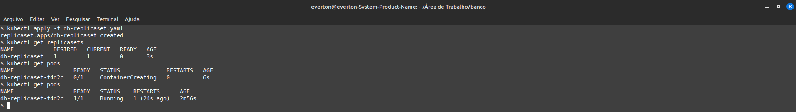
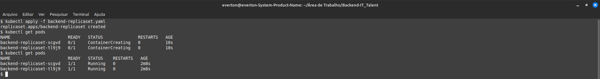
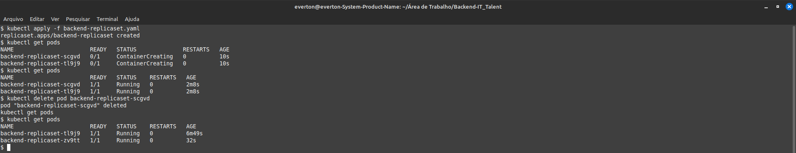

# ittalent-hackathon4K8s

## Antonio Everton Gomes Do Nascimento

### Descrição da atividade
Para essa atividade, iremos criar um ReplicaSet com 1 instância do Banco de Dados e 2 do backend.

### Prints

#### ReplicaSet DB

#### ReplicaSet BackEnd

#### ReplicaSet Novo Pod Backend
